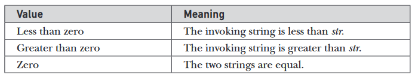
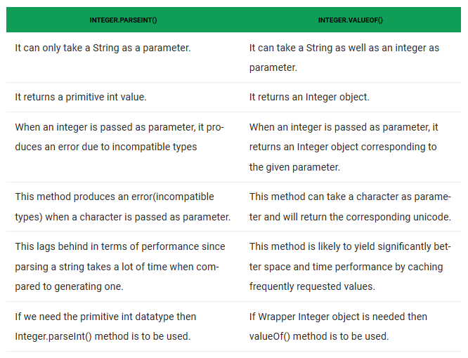
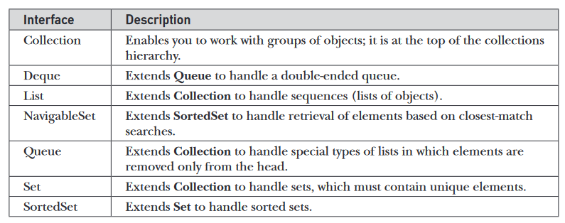
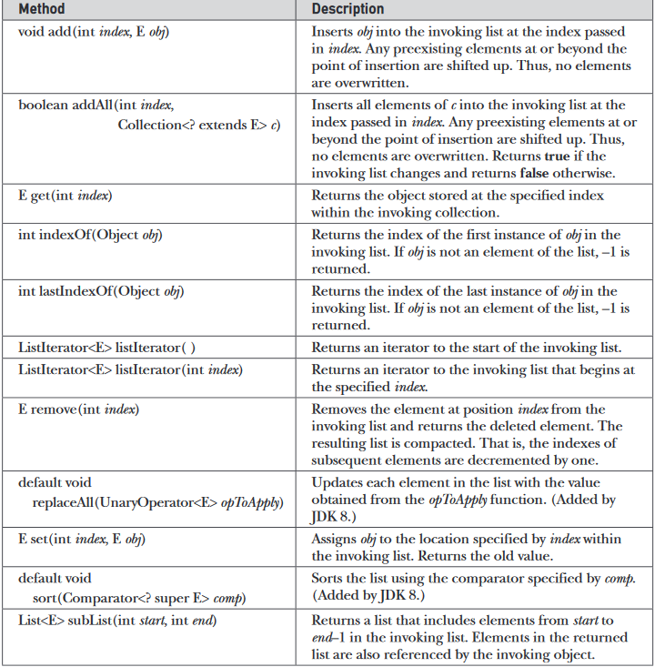
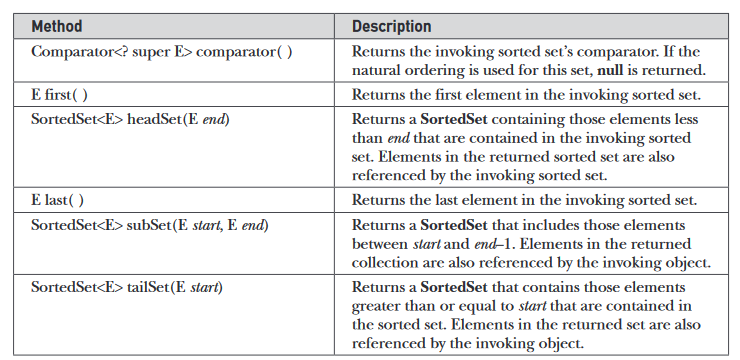
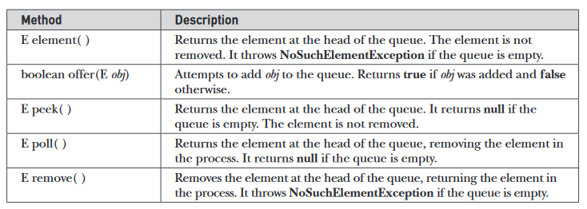
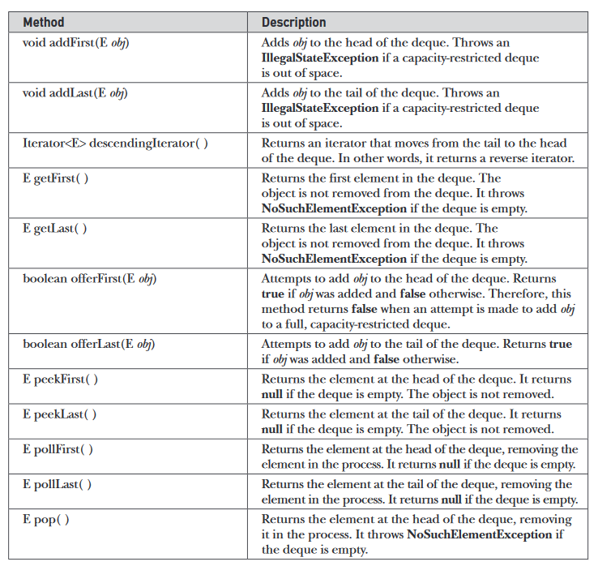

# Java Libraries Usage Notes

## Links
- https://www.geeksforgeeks.org/java-tricks-competitive-programming-java-8/
- 

## Standard Libraries

### String Handling
- Unlike some other languages that implement strings as character arrays, Java implements strings as objects of type String.
- Somewhat unexpectedly, when you create a String object, you are creating a string that cannot be changed. That is, once a String object has been created, you cannot change the characters that comprise that string. At first, this may seem to be a serious restriction. However, such is not the case. You can still perform all types of string operations. The difference is that each time you need an altered version of an existing string, a new Stringobject is created that contains the modifications. The original string is left unchanged. This approach is used because fixed, immutable strings can be implemented more efficiently than changeable ones. 
- The `String`, `StringBuffer`, and `StringBuilder` classes are defined in `java.lang`.
  - All are declared `final`, which means that none of these classes may be subclassed.
- To say that the strings within objects of type String are unchangeable means that the contents of the String instance cannot be changed after it has been created. However, a variable declared as a String reference can be changed to point at some other String object at any time.
- String Constructors
  - To create an empty string: `String s = new String();`
  - To create a String initialized by an array of characters: `String(char chars[ ])`
  - You can specify a subrange of a character array as an initializer using the following constructor: `String(char chars[ ], int startIndex, int numChars)`. Here, startIndex specifies the index at which the subrange begins, and numChars specifies the number of characters to use. 
  - You can construct a String object that contains the same character sequence as another String object: `String(String strObj)`.
  - [Constructing Strings](https://github.com/zed1025/java-library-notes/blob/master/constructingStrings.java)
- Even though Java’s char type uses 16 bits to represent the basic Unicode character set, the typical format for strings on the Internet uses arrays of 8-bit bytes constructed from the ASCII character set. Because 8-bit ASCII strings are common, the String class provides constructors that initialize a string when given a byte array. 
  - `String(byte chrs[ ])`
  - `String(byte chrs[ ], int startIndex, int numChars)`
  - Here, chrs specifies the array of bytes. The second form allows you to specify a subrange. In each of these constructors, the byte-to-character conversion is done by using the default character encoding of the platform. 
  - [Byte to String](https://github.com/zed1025/java-library-notes/blob/master/byteToString.java)
- The contents of the array are copied whenever you create a String object from an array. If you modify the contents of the array after you have created the string, the String will be unchanged.
- You can construct a String from a StringBuffer: `String(StringBuffer strBufObj)`
- You can construct a String from a StringBuilder: `You can construct a String from a StringBuilder`
- **String length**: The length of a string is the number of characters that it contains. o obtain this value, call the `length( )` method. 
  - [String Length](https://github.com/zed1025/java-library-notes/blob/master/stringLength.java)
- Java does not allow operators to be applied to String objects. The one exception to this rule is the + operator, which **concatenates** two strings, producing a String object as the result. This allows you to chain together a series of + operations.
- When Java converts data into its string representation during concatenation, it does so by calling one of the overloaded versions of the string conversion method `valueOf( )` defined by String. `valueOf( )` is overloaded for all the primitive types and for type Object. For the primitive types, `valueOf( )` returns a string that contains the human-readable equivalent of the value with which it is called. For objects, `valueOf( )` calls the `toString( )` method on the object. More on valueOf( ) later.
- Every class implements toString( ) because it is defined by Object. However, the default implementation of toString( ) is seldom sufficient. For most important classes that you create, you will want to override toString( ) and provide your own string representations. Fortunately, this is easy to do. The toString( ) method has this general form: `String toString( )`. [toString Demo](https://github.com/zed1025/java-library-notes/blob/master/toStringDemo.java)
- **Character Extraction from String**:
  - Although the characters that comprise a string within a String object cannot be indexed as if they were a character array, many of the String methods employ an index (or offset) into the string for their operation. Like arrays, the string indexes begin at zero.
  - To extract a single character from a String, you can refer directly to an individual character via the charAt( ) method. General form: `char charAt(int where)`.
  - If you need to extract more than one character at a time, you can use the `getChars( )` method. General form: `void getChars(int sourceStart, int sourceEnd, char target[ ], int targetStart)`. Here, sourceStart specifies the index of the beginning of the substring, and sourceEndspecifies an index that is one past the end of the desired substring. Thus, the substring contains the characters from sourceStart through sourceEnd–1. The array that will receive the characters is specified by target. The index within target at which the substring will be copied is passed in targetStart. Care must be taken to assure that the target array is large enough to hold the number of characters in the specified substring. [getCharsDemo](https://github.com/zed1025/java-library-notes/blob/master/getCharsDemo.java) 
  - There is an alternative to getChars( ) that stores the characters in an array of bytes. This method is called `getBytes( )`, and it uses the default character-to-byte conversions provided by the platform. General form: `byte[ ] getBytes( )`. getBytes( ) is most useful when you are exporting a String value into an environment that does not support 16-bit Unicode characters. For example, most Internet protocols and text file formats use 8-bit ASCII for all text interchange.
  - If you want to convert all the characters in a String object into a character array, the easiest way is to call `toCharArray( )`. It returns an array of characters for the entire string. General form: `char[ ] toCharArray( )`. This function is provided as a convenience, since it is possible to use getChars( ) to achieve the same result. [toCharArray Demo](https://github.com/zed1025/java-library-notes/blob/master/toCharArrayDemo.java)
- **String Comparison**:
  - To compare two strings for equality, use equals( ). General form: `boolean equals(Object str)`. Here, str is the String object being compared with the invoking String object. It returns true if the strings contain the same characters in the same order, and false otherwise. The comparison is case-sensitive.
  - To perform a comparison that ignores case differences, call equalsIgnoreCase( ). Genral form: `boolean equalsIgnoreCase(String str)`. [Equals and EqualsIgnoreCase Demo](https://github.com/zed1025/java-library-notes/blob/master/equalsDemo.java)
  - The regionMatches( ) method compares a specific region inside a string with another specific region in another string. There is an overloaded form that allows you to ignore case in such comparisons. General form: 
    - `boolean regionMatches(int startIndex, String str2, int str2StartIndex, int numChars)`
    - `boolean regionMatches(boolean ignoreCase, int startIndex, String str2, int str2StartIndex, int numChars)`
    - For both versions, startIndex specifies the index at which the region begins within the invoking String object. The String being compared is specified by str2. The index at which the comparison will start within str2 is specified by str2StartIndex. The length of the substring being compared is passed in numChars. In the second version, if ignoreCase is true, the case of the characters is ignored. Otherwise, case is significant.
    - [Region Matches Demo]()
  - String defines two methods that are, more or less, specialized forms of regionMatches( ). The startsWith( ) method determines whether a given String begins with a specified string. Conversely, endsWith( ) determines whether the String in question ends with a specified string. They have the following general forms:
    - `boolean startsWith(String str)`
    - `boolean endsWith(String str)`
    - A second form of startsWith( ), shown here, lets you specify a starting point: `boolean startsWith(String str, int startIndex)`
    - [Starts/Ends With Demo](https://github.com/zed1025/java-library-notes/blob/master/startsEndsWithDemo.java)
  - Difference between `equals()` and `==`
    - `equals( )` method compares the characters inside a String object.
    - The `==` operator compares two object references to see whether they refer to the same instance. 
    - [equalsNotEqualTo](https://github.com/zed1025/java-library-notes/blob/master/equalsOperatorVsMethod.java)
  - Often, it is not enough to simply know whether two strings are identical. You need to know which is less than, equalto, or greater than the next. A string is less than another if it comes before the other in dictionary order. A string is greater than another if it comes after the other in dictionary order. The method compareTo( ) serves this purpose. It is specified by the Comparable<T> interface, which String implements. It has this general form: `int compareTo(String str)`. Here, str is the String being compared with the invoking String. The result of the comparison is returned and is interpreted as shown here: .
    - [Bubble sort using compareTo](https://github.com/zed1025/java-library-notes/blob/master/bubbleSortOfStrings.java)
    - `compareTo( )` takes into account uppercase and lowercase letters.
    - If you want to ignore case differences when comparing two strings, use `compareToIgnoreCase( )`, general form: `int compareToIgnoreCase(String str)`
- **Searching Strings**:
  - The String class provides two methods that allow you to search a string for a specified character or substring:
    - `indexOf( )`:  Searches for the first occurrence of a character or substring
    - `lastIndexOf( )`: Searches for the last occurrence of a character or substring
    - the methods return the index at which the character or substring was found, or –1 on failure.
    - To search for the first occurrence of a character, use: `int indexOf(int ch)`. Here, ch is the character being sought.
    - To search for the last occurrence of a character, use: `int lastIndexOf(int ch)`. Here, ch is the character being sought.
    - To search for the first or last occurrence of a substring, use: `int indexOf(String str)`, and `int lastIndexOf(String str)`.
    - You can specify a starting point for the search using these forms: `int indexOf(String str, int startIndex)`. Will work for chars and lastIndexOf too
    - [Searching Strings](https://github.com/zed1025/java-library-notes/blob/master/indexOfMethod.java)
- **Modifying a String**:
  - Because String objects are immutable, whenever you want to modify a String, you must either copy it into a StringBuffer or StringBuilder, or use a String method that constructs a new copy of the string with your modifications complete.
  - You can extract a substring using `substring( )`. It has two forms
    - `String substring(int startIndex)`
    - `String substring(int startIndex, int endIndex)`
    - The following program uses substring( ) to replace all instances of one substring with another within a string: [Substring Demo](https://github.com/zed1025/java-library-notes/blob/master/substringDemo.java)
  - You can concatenate two strings using concat( ). General form: `String concat(String str)`. concat( ) performs the same function as `+`.
    ```
    String s1 = "one";
    String s2 = s1.concat("two");
    ```
  - `replace()`, has two general forms. 
    - The first replaces all occurrences of one character in the invoking string with another character. `String replace(char original, char replacement)`
    - The second form of replace( ) replaces one character sequence with another. It has this general form: `String replace(CharSequence original, CharSequence replacement)`
    - [Replace Demo](https://github.com/zed1025/java-library-notes/blob/master/replaceDemo.java)
  - The `trim( )` method returns a copy of the invoking string from which any leading and trailing whitespace has been removed. General form: `String trim( )`.
    - Simple usage: `String s = "   Hello World    ".trim();`.
    - The trim( ) method is quite useful when you process user commands. For example, the following program prompts the user for the name of a state and then displays that state’s capital. It uses trim( ) to remove any leading or trailing whitespace that may have inadvertently been entered by the user.
    - [Trim Demo](https://github.com/zed1025/java-library-notes/blob/master/trimDemo.java)
- `valueOf( )`
  - The valueOf( ) method converts data from its internal format into a human-readable form. It is a static method that is overloaded within String for all of Java’s built-in types so that each type can be converted properly into a string. 
  - valueOf( ) is also overloaded for type Object, so an object of any class type you create can also be used as an argument.
  - Some forms of valueOf()
    - `static String valueOf(double num)`
    - `static String valueOf(long num)`
    - `static String valueOf(Object ob)`
    - `static String valueOf(char chars[ ])`
  - As discussed earlier, valueOf( ) is called when a string representation of some other type of data is needed—for example, during concatenation operations. You can call this method directly with any data type and get a reasonable String representation. All of the simple types are converted to their common String representation. Any object that you pass to valueOf( ) will return the result of a call to the object’s toString( ) method. In fact, you could just call toString( ) directly and get the same result.
  - For most arrays, valueOf( ) returns a rather cryptic string, which indicates that it is an array of some type. For arrays of char, however, a String object is created that contains the characters in the char array. There is a special version of valueOf( ) that allows you to specify a subset of a char array. It has this general form: `static String valueOf(char chars[ ], int startIndex, int numChars)`
    - Here, chars is the array that holds the characters, startIndex is the index into the array of characters at which the desired substring begins, and numChars specifies the length of the substring.
- **Changing Case of Characters within strings**:
  - The method toLowerCase( ) converts all the characters in a string from uppercase to lowercase. The toUpperCase( ) method converts all the characters in a string from lowercase to uppercase. 
  - [Case Changing](https://github.com/zed1025/java-library-notes/blob/master/changeCases.java)
  - verloaded versions of toLowerCase( ) and toUpperCase( ) that let you specify a `Locale` object to govern the conversion are also supplied. Specifying the locale can be quite important in some cases and can help internationalize your application.
- JDK 8 adds a new method to String called join( ). It is used to concatenate two or more strings, separating each string with a delimiter, such as a space or a comma. It has two forms. Its first is shown here: `static String join(CharSequence delim, CharSequence . . . strs)`. Here, delim specifies the delimiter used to separate the character sequences specified by strs. Because String implements the CharSequence interface, strs can be a list of strings.
  - The second form of join( ) lets you join a list of strings obtained from an object that implements the Iterable interface. 
  - [Join Demo](https://github.com/zed1025/java-library-notes/blob/master/joinDemo.java)
- Some more methods
  - `boolean contains(CharSequence str)`: Returns true if the invoking object contains the string specified by str. Returns false otherwise.
  - `boolean isEmpty( )`: Returns true if the invoking string contains no characters and has a length of zero. 
  - `boolean matches(string regExp)`: Returns true if the invoking string matches the regular expression passed in regExp. Otherwise, returns false
  - `String replaceAll(String regExp, String newStr)`: Returns a string in which all substrings that match the regular expression specified by regExp are replaced by newStr.
- `StringBuffer` Intro:
  - StringBuffer supports a modifiable string. As you know, String represents fixed-length, immutable character sequences. In contrast, StringBuffer represents growable and writable character sequences. StringBuffer may have characters and substrings inserted in the middle or appended to the end. StringBuffer will automatically grow to make room for such additions and often has more characters preallocated than are actually needed, to allow room for growth.
  - StringBuffer constructors
    - `StringBuffer( )`. The default constructor (the one with no parameters) reserves room for 16 characters without reallocation. 
    - `StringBuffer(int size)`. The second version accepts an integer argument that explicitly sets the size of the buffer. 
    - `StringBuffer(String str)`: The third version accepts a String argument that sets the initial contents of the StringBuffer object and reserves room for 16 more characters without reallocation. (StringBuffer allocates room for 16 additional characters when no specific buffer length is requested, because reallocation is a costly process in terms of time. Also, frequent reallocations can fragment memory. By allocating room for a few extra characters, StringBuffer reduces the number of reallocations that take place.)
    - `StringBuffer(CharSequence chars)`: The fourth constructor creates an object that contains the character sequence contained in chars and reserves room for 16 more characters.
  - The current length of a StringBuffer can be found via the `length( )` method, while the total allocated capacity can be found through the `capacity( )` method. [StringBuffer length vs. capacity](https://github.com/zed1025/java-library-notes/blob/master/lengthVsCapacity.java)
  - If you want to preallocate room for a certain number of characters after a StringBuffer has been constructed, you can use `ensureCapacity( )` to set the size of the buffer. This is useful if you know in advance that you will be appending a large number of small strings to a StringBuffer. ensureCapacity( ) has this general form: `void ensureCapacity(int minCapacity)`. Here, minCapacity specifies the minimum size of the buffer. (A buffer larger than minCapacitymay be allocated for reasons of efficiency.) [StringBuffer Ensuring Capacity](https://github.com/zed1025/java-library-notes/blob/master/ensureCap.java). [More](https://www.geeksforgeeks.org/stringbuffer-ensurecapacity-method-in-java-with-examples/)
  - To set the length of the string within a StringBuffer object, use `setLength( )`. General form: `void setLength(int len)`. Here, len specifies the length of the string. This value must be nonnegative. When you increase the size of the string, null characters are added to the end. If you call setLength( ) with a value less than the current value returned by length( ), then the characters stored beyond the new length will be lost.
  - The value of a single character can be obtained from a StringBuffer via the `charAt( )` method. You can set the value of a character within a StringBuffer using `setCharAt( )`. General forms: `char charAt(int where)` and `void setCharAt(int where, char ch)`. For charAt( ), where specifies the index of the character being obtained. For setCharAt( ), where specifies the index of the character being set, and ch specifies the new value of that character. For both methods, where must be nonnegative and must not specify a location beyond the end of the string. [StringBuffer Using Character At](https://github.com/zed1025/java-library-notes/blob/master/setCharAtDemo.java)
  - To copy a substring of a StringBuffer into an array, use the getChars( ) method. It has this general form: `void getChars(int sourceStart, int sourceEnd, char target[ ], int targetStart)`. Here, sourceStart specifies the index of the beginning of the substring, and sourceEndspecifies an index that is one past the end of the desired substring. This means that the substring contains the characters from sourceStart through sourceEnd–1. The array that will receive the characters is specified by target. The index within target at which the substring will be copied is passed in targetStart. Care must be taken to assure that the target array is large enough to hold the number of characters in the specified substring.
  - The append( ) method concatenates the string representation of any other type of data to the end of the invoking StringBuffer object. It has several overloaded versions. Here are a few of its forms: 
    - `StringBuffer append(String str)`
    - `StringBuffer append(int num)`
    - `StringBuffer append(Object obj)`
    - The string representation of each parameter is obtained, often by calling String.valueOf( ). The result is appended to the current StringBuffer object. The buffer itself is returned by each version of append( ). This allows subsequent calls to be chained together, as shown in the following example: [StringBuffer append() Demo](https://github.com/zed1025/java-library-notes/blob/master/appendDemo.java)
  - The `insert( )` method inserts one string into another. It is overloaded to accept values of all the primitive types, plus Strings, Objects, and CharSequences. Like append( ), it obtains the string representation of the value it is called with. This string is then inserted into the invoking StringBuffer object. These are a few of its forms:
    - `StringBuffer insert(int index, String str)`
    - `StringBuffer insert(int index, char ch)`
    - `StringBuffer insert(int index, Object obj)`
    - The following sample program inserts "like" between "I" and "Java": [StringBuffer insert() Demo](https://github.com/zed1025/java-library-notes/blob/master/insertDemo.java)
  - You can reverse the characters within a StringBuffer object using reverse( ), shown here: `StringBuffer reverse( )`. [StringBuffer Reverse Demo](https://github.com/zed1025/java-library-notes/blob/master/reverseDemo.java)
  - You can delete characters within a StringBuffer by using the methods delete( ) and deleteCharAt( ). These methods are shown here:
    - `StringBuffer delete(int startIndex, int endIndex)`
    - `StringBuffer deleteCharAt(int loc)`
    - [StringBuffer Delete Demo](https://github.com/zed1025/java-library-notes/blob/master/deleteDemo.java)
  - You can replace one set of characters with another set inside a StringBuffer object by calling replace( ). Its signature is shown here: `StringBuffer replace(int startIndex, int endIndex, String str)`. 
    - The substring being replaced is specified by the indexes startIndex and endIndex. Thus, the substring at startIndex through endIndex–1 is replaced. The replacement string is passed in str.
    - [StringBuffer Replace Demo](https://github.com/zed1025/java-library-notes/blob/master/replaceDemo2.java)
  - You can obtain a portion of a StringBuffer by calling substring( ). It has the following two forms:
    - `String substring(int startIndex)`
    - `String substring(int startIndex, int endIndex)`
- More StringBuilder methods
  - `int indexOf(String str)`: Searches the invoking StringBuffer for the first occurrence of str. Returns the index of the match, or –1 if no match is found.
  - `int indexOf(String str, int startIndex)`: Searches the invoking StringBuffer for the first occurrence of str, beginning at startIndex. Returns the index of the match, or –1 if no match is found.
  - `int lastIndexOf(String str)`: Searches the invoking StringBuffer for the last occurrence of str. Returns the index of the match, or –1 if no match is found.
  - `int lastIndexOf(String str, int startIndex)`: Searches the invoking StringBuffer for the last occurrence of str, beginning at startIndex. Returns the index of the match, or –1 if no match is found.
  - [StringBuffer indexOf Demo](https://github.com/zed1025/java-library-notes/blob/master/indexOfDemo.java)
- **StringBuilder**
  - Introduced by JDK 5, StringBuilder is a relatively recent addition to Java’s string handling capabilities. StringBuilder is similar to StringBuffer except for one important difference: it is not synchronized, which means that it is not thread-safe. The advantage of StringBuilderis faster performance. However, in cases in which a mutable string will be accessed by multiple threads, and no external synchronization is employed, you must use StringBuffer rather than StringBuilder.


### java.lang
- `java.lang` is automatically imported into all programs
- It is Java’s most widely used package.
- Primitve Type Wrappers
  - Java uses primitive types, such as int and char, for performance reasons. These data types are not part of the object hierarchy. They are passed by value to methods and cannot be directly passed by reference. 
  - Also, there is no way for two methods to refer to the same instance of an int. 
  - `Number`
    - The abstract class Number defines a superclass that is implemented by the classes that wrap the numeric types byte, short, int, long, float, and double. 
    - Number has abstract methods that return the value of the object in each of the different number formats. For example, doubleValue( ) returns the value as a double, floatValue( ) returns the value as a float, and so on. 
      - byte byteValue( )
      - double doubleValue( )
      - float floatValue( )
      - int intValue( )
      - long longValue( )
      - short shortValue( )
    - Number has concrete subclasses that hold explicit values of each primitive numeric type: Double, Float, Byte, Short, Integer, and Long.
    - Double and Float are wrappers for floating-point values of type double and float, respectively. Constructors for Float and Double
      - Float(double num)
      - Float(float num)
      - Float(String str) throws NumberFormatException
      - Double(double num)
      - Double(String str) throws NumberFormatException
    - Double(Float) objects can be constructed with a double(double/float) value or a string containing a floating-point value.
    - Difference between Double.valueOf() and Double.parseDouble(). Applies for Float, Double, Integer too. . Also see [this](https://www.geeksforgeeks.org/integer-valueof-vs-integer-parseint-with-examples/)
    - Important methods defined by Float
      - `static float max(float val, float val2)`: Returns the maximum of val and val2. (Added by JDK 8.)
      - `static float min(float val, float val2)`
      - `static String toHexString(float num)`: Returns a string containing the value of num in hexadecimal format.
      - `int intValue( )`: Returns the value of the invoking object as an int.
      - `static int compare(float num1, float num2)`: Compares the values of num1 and num2. Returns 0 if the values are equal. Returns a negative value if num1 is less than num2. Returns a positive value if num1 is greater than num2.
    - Important methods defined by Double
      - `static int compare(double num1, double num2)`
      - `static String toHexString(double num)`
    - Important methods defined by Integer
      - `static int bitCount(int num)`: Returns the number of set bits in num.
      - `static int reverse(int num)`: Reverses the order of the bits in num and returns the result.
      - `static int rotateLeft(int num, int n)`: Returns the result of rotating num left n positions.
      - `static int rotateRight(int num, int n)`: Returns the result of rotating num right n positions.
      - `static String toBinaryString(int num)`: Returns a string that contains the binary equivalent of num
      - `static String toOctalString(int num)`
    - `Character` wrapper: Character is a simple wrapper around a char. The constructor for Character is: `Character(char ch)`
      - To obtain the char value contained in a Character object, call `charValue( )`
      - Character includes several static methods that categorize characters and alter their case. [Char Demo](https://github.com/zed1025/java-library-notes/blob/master/IsDemo.java)
      - Character defines two methods, forDigit( ) and digit( ), that enable you to convert between integer values and the digits they represent. 
        - `static char forDigit(int num, int radix)`: forDigit( ) returns the digit character associated with the value of num. The radix of the conversion is specified by radix. 
        - `static int digit(char digit, int radix)`: digit( ) returns the integer value associated with the specified character (which is presumably a digit) according to the specified radix.
- **Memory Management**
  - Although Java provides automatic garbage collection, sometimes you will want to know how large the object heap is and how much of it is left. You can use this information, for example, to check your code for efficiency or to approximate how many more objects of a certain type can be instantiated. 
  - To obtain these values, use the `totalMemory( )` and `freeMemory( )`methods.
  - Java’s garbage collector runs periodically to recycle unused objects. However, sometimes you will want to collect discarded objects prior to the collector’s next appointed rounds. You can run the garbage collector on demand by calling the gc( ) method. A good thing to try is to call gc( ) and then call freeMemory( ) to get a baseline memory usage. Next, execute your code and call freeMemory( ) again to see how much memory it is allocating. The following program illustrates this idea: [Forced Memory Mgt](https://github.com/zed1025/java-library-notes/blob/master/MemoryDemo.java)
- [Running Other Programs](https://github.com/zed1025/java-library-notes/blob/master/ExecDemo.java)
- [Running Other Programs 2](https://github.com/zed1025/java-library-notes/blob/master/ExecDemoFini.java)
- [Timing Program Execution](https://github.com/zed1025/java-library-notes/blob/master/Elapse.java)
- Math Class
  - The Math class contains all the floating-point functions that are used for geometry and trigonometry, as well as several general-purpose methods. 
  - Math defines two doubleconstants: E (approximately 2.72) and PI (approximately 3.14).
  - Trigonometric functions
    - `static double sin(double arg)`: Returns the sine of the angle specified by arg in radians.
    - `static double cos(double arg)`
    - `static double tan(double arg)`
    - `static double asin(double arg)`: Returns the angle whose sine is specified by arg.
    - `static double acos(double arg)`
    - `static double atan(double arg)`
    - `static double atan2(double x, double y)`: Returns the angle whose tangent is x/y.
    - `static double sinh(double arg)`: Returns the hyperbolic sine of the angle specified by arg
    - `static double cosh(double arg)`
    - `static double tanh(double arg)`
  - Exponential Functions
    - `static double cbrt(double arg)`: Returns the cube root of arg
    - `static double exp(double arg)`: Returns e to the arg.
    - `static double expm1(double arg)`: Returns e to the arg–1.
    - `static double log(double arg)`: Returns the natural logarithm of arg
    - `static double log10(double arg)`: Returns the base 10 logarithm for arg.
    - `static double log1p(double arg)`: Returns the natural logarithm for arg + 1.
    - `static double pow(double y, double x)`: Returns y raised to the x; for example, pow(2.0, 3.0) returns 8.0.
    - `static double sqrt(double arg)`: Returns the square root of arg.
  - Rounding Functions
    - `static int abs(int arg)`, available for float, double, long
    - `static double ceil(double arg)`
    - `static double floor(double arg)`
  - Misc
    - `static int max(int x, int y)`, available for long, float, double


### Scanner class
- It reads formatted input and converts it into its binary form. Scanner can be used to read input from the console, a file, a string, or any source that implements the Readable interface or ReadableByteChannel. 
- For example, you can use Scanner to read a number from the keyboard and assign its value to a variable. 
- This next line creates a Scanner that reads from standard input, which is the keyboard by default: `Scanner conin = new Scanner(System.in);`
- Scanner defines two sets of methods that enable you to read input. 
  - The first are the hasNextX methods. These methods determine if the specified type of input is available. For example, calling hasNextInt( )returns true only if the next token to be read is an integer. If the desired data is available, then you read it by calling one of Scanner’s nextX methods
    - `boolean hasNext( )`: Returns true if another token of any type is available to be read. Returns false otherwise.
    - `boolean hasNextDouble( )`
    - `boolean hasNextFloat( )`
    - `boolean hasNextInt( )`
    - `String next( )`: Returns the next token of any type from the input source.
    - `double nextDouble( )`: Returns the next token as a double value.
    - `float nextFloat( )`
    - `int nextInt( )`
    - `String nextLine( )`
    - `long nextLong( )`


### Collection Framework
- Collection Interfaces
- Beginning with the collection interfaces is necessary because they determine the fundamental nature of the collection classes. Put differently, the concrete classes simply provide different implementations of the standard interfaces. The interfaces that underpin collections are summarized in the following table: 
- **The `Collection` Interface**
  - The Collection interface is the foundation upon which the Collections Framework is built because it must be implemented by any class that defines a collection. 
  - Declaration: `interface Collection<E>`, Here, E specifies the type of objects that the collection will hold. Collection extends the Iterable interface. This means that all collections can be cycled through by use of the for-each style for loop.
  - Recall that only classes that implement `Iterable` can be cycled through by the `for`.
  - Refer Page 502 for full collection of methods of the Collection Interface
  - Some Important Methods
    - `boolean add(E obj)`
    - `boolean addAll(Collection<? extends E> c)`
    - `void clear( )`: Removes all elements from the invoking collection.
    - `boolean contains(Object obj)`: Returns true if obj is an element of the invoking collection. Otherwise, returns false
    - `boolean containsAll(Collection<?> c)`: Returns true if the invoking collection contains all elements of c. Otherwise, returns false.
    - `boolean equals(Object obj)`: Returns true if the invoking collection and obj are equal. Otherwise, returns false.
    - `boolean isEmpty( )`
    - `Iterator<E> iterator( )`: Returns an iterator for the invoking collection.
    - `boolean remove(Object obj)`
    - `boolean removeAll(Collection<?> c)`
    - `int size( )`
    - `Object[ ] toArray( )`: Returns an array that contains all the elements stored in the invoking collection. The array elements are copies of the collection elements.
    - `boolean retainAll(Collection<?> c)`: Removes all elements from the invoking collection except those in c. Returns true if the collection changed (i.e., elements were removed). Otherwise, returns false.
- **The `List` Interface**
  - The List interface extends Collection and declares the behavior of a collection that stores a sequence of elements. 
  - Elements can be inserted or accessed by their position in the list, using a zero-based index. A list may contain duplicate elements.
  - Declaration: `interface List<E>`. Here, E specifies the type of objects that the list will hold.
  - Methods. 
- **The `Set` Interface**
  - The Set interface defines a set. It extends Collection and specifies the behavior of a collection that does not allow duplicate elements. 
  - Therefore, the `add( )` method returns `false` if an attempt is made to add duplicate elements to a set.
  - It does not specify any additional methods of its own. Set is a generic interface that has this declaration: `interface Set<E>`
- **The `SortedSet` Interface**
  - The SortedSet interface extends Set and declares the behavior of a set sorted in ascending order. SortedSet is a generic interface that has this declaration: `interface SortedSet<E>`
  - In addition to those methods provided by Set, the SortedSet interface declares the following methods 
- **The `NavigableSet` Interface**
  - The NavigableSet interface extends SortedSet and declares the behavior of a collection that supports the retrieval of elements based on the closest match to a given value or values. NavigableSet is a generic interface that has this declaration: `interface NavigableSet<E>`
  - Method list on Page 507
- **The `Queue` Interface**
  - The Queue interface extends Collection and declares the behavior of a queue, which is often a first-in, first-out list. However, there are types of queues in which the ordering is based upon other criteria. Queue is a generic interface that has this declaration: `interface Queue<E>`
  - 
- **The `Deque` Interface**
  - The Deque interface extends Queue and declares the behavior of a double-ended queue. Double-ended queues can function as standard, first-in, first-out queues or as last-in, first-out stacks. Deque is a generic interface that has this declaration: `interface Deque<E>`
  - 
- **The Collection Classes**
  - **The `ArrayList` Class**
    - The ArrayList class extends AbstractList and implements the List interface. ArrayList is a generic class that has this declaration: `class ArrayList<E>`. Here, E specifies the type of objects that the list will hold.
    - ArrayList supports _dynamic arrays_ that can grow as needed. 
    - An ArrayList can dynamically increase or decrease in size. Array lists are created with an initial size. When this size is exceeded, the collection is automatically enlarged. When objects are removed, the array can be shrunk.
    - ArrayList has the following constructors
      - `ArrayList( )`
      - `ArrayList(Collection<? extends E> c)`
      - `ArrayList(int capacity)`
    - [Example 1](https://github.com/zed1025/java-library-notes/blob/master/ArrayListDemo.java)
    - Although the capacity of an ArrayList object increases automatically as objects are stored in it, you can increase the capacity of an ArrayList object manually by calling `void ensureCapacity( int capaity )`. You might want to do this if you know in advance that you will be storing many more items in the collection than it can currently hold. By increasing its capacity once, at the start, you can prevent several reallocations later. Because reallocations are costly in terms of time, preventing unnecessary ones improves performance.
    - Conversely, if you want to reduce the size of the array that underlies an ArrayListobject so that it is precisely as large as the number of items that it is currently holding, call `trimToSize( )`
    - [Converting ArrayList to Array](https://github.com/zed1025/java-library-notes/blob/master/ArrayListToArray.java)
  - **The `LinkedList` Class**
    - The LinkedList class extends AbstractSequentialList and implements the List, Deque, and Queue interfaces. It provides a linked-list data structure. 
    - Constructors
      - LinkedList( )
      - LinkedList(Collection<? extends E> c)
    - Because LinkedList implements the Deque interface, you have access to the methods defined by Deque. For example, to add elements to the start of a list, you can use `addFirst( )` or `offerFirst( )`. To add elements to the end of the list, use `addLast( )` or `offerLast( )`. To obtain the first element, you can use `getFirst( )` or `peekFirst( )`. To obtain the last element, use `getLast( )` or `peekLast( )`. To remove the first element, use `removeFirst( )` or `pollFirst( )`. To remove the last element, use `removeLast( )` or `pollLast( )`.
    - [Linked List Demo](https://github.com/zed1025/java-library-notes/blob/master/LinkedListDemo.java)
    - Because LinkedList implements the List interface, calls to add(E) append items to the end of the list, as do calls to addLast( ). To insert items at a specific location, use the add(int, E) form of add( ), as illustrated by the call to add(1, "A2") in the example.
    - Notice how the third element in ll is changed by employing calls to `get( )` and `set( )`. To obtain the current value of an element, pass get( ) the index at which the element is stored. To assign a new value to that index, pass `set( )` the index and its new value.
  - ****The `HashSet` Class**
    - HashSet extends AbstractSet and implements the Set interface. 
    - `HashSet` stores data using the Hashing mechanism. 
    - In hashing, the informational content of a key is used to determine a unique value, called its hash code. The hash code is then used as the index at which the data associated with the key is stored
    - The transformation of the key into its hash code is performed automatically — you never see the hash code itself. 
    - Also, your code can’t directly index the hash table. The advantage of hashing is that it allows the execution time of `add( )`, `contains( )`, `remove( )`, and `size( )` to remain constant even for large sets.
    - Constructors
      - `HashSet( )`
      - `HashSet(Collection<? extends E> c)`
      - `HashSet(int capacity)`
      - `HashSet(int capacity, float fillRatio)`
    - The first form constructs a default hash set. The second form initializes the hash set by using the elements of c. The third form initializes the capacity of the hash set to capacity. (The default capacity is 16.) The fourth form initializes both the capacity and the fill ratio (also called _load capacity_ ) of the hash set from its arguments. The fill ratio must be between 0.0 and 1.0, and it determines how full the hash set can be before it is resized upward. Specifically, when the number of elements is greater than the capacity of the hash set multiplied by its _fill ratio_, the hash set is expanded. For constructors that do not take a fill ratio, _0.75_ is used.
    - It is important to note that HashSet does not guarantee the order of its elements, because the process of hashing doesn’t usually lend itself to the creation of sorted sets. If you need sorted storage, then another collection, such as TreeSet, is a better choice.
    - [HashSet Demo](https://github.com/zed1025/java-library-notes/blob/master/HashSetDemo.java)
  - **The `LinkedHashSet` Class**
    - The LinkedHashSet class extends HashSet and adds no members of its own.
    - LinkedHashSet maintains a linked list of the entries in the set, in the order in which they were inserted. This allows insertion-order iteration over the set. That is, when cycling through a LinkedHashSet using an iterator, the elements will be returned in the order in which they were inserted
    -  To see the effect of LinkedHashSet, try substituting LinkedHashSet for HashSet in the preceding program. The output will be in the order in which the elements were inserted.
 -  **The `TreeSet` Class**
    - TreeSet extends AbstractSet and implements the NavigableSet interface. 
    - It creates a collection that uses a tree for storage. 
    - Objects are stored in sorted, ascending order. 
    - Access and retrieval times are quite fast, which makes TreeSet an excellent choice when storing large amounts of sorted information that must be found quickly.
    - TreeSet has the following constructors:
      - `TreeSet( )`
      - `TreeSet(Collection<? extends E> c)`
      - `TreeSet(Comparator<? super E> comp)`
      - `TreeSet(SortedSet<E> ss)`
    - The first form constructs an empty tree set that will be sorted in ascending order according to the natural order of its elements. The second form builds a tree set that contains the elements of c. The third form constructs an empty tree set that will be sorted according to the comparator specified by comp. (Comparators are described later) The fourth form builds a tree set that contains the elements of ss.
    - [TreeSet Demo](https://github.com/zed1025/java-library-notes/blob/master/TreeSetDemo.java)
    - Because TreeSet implements the NavigableSet interface, you can use the methods defined by NavigableSet to retrieve elements of a TreeSet. For example, assuming the preceding program, the following statement uses subSet( ) to obtain a subset of ts that contains the elements between C (inclusive) and F (exclusive). It then displays the resulting set. 
  - **The `PriorityQueue` Class**
    - PriorityQueue extends AbstractQueue and implements the Queue interface. It creates a queue that is prioritized based on the queue’s comparator.
    - PriorityQueue defines the six constructors shown here:
      - `PriorityQueue( )`
      - `PriorityQueue(int capacity)`
      - `PriorityQueue(Comparator<? super E> comp) (Added by JDK 8.)`
      - `PriorityQueue(int capacity, Comparator<? super E> comp)`
      - `PriorityQueue(Collection<? extends E> c)`
      - `PriorityQueue(PriorityQueue<? extends E> c)`
      - `PriorityQueue(SortedSet<? extends E> c)`
    - If no comparator is specified when a PriorityQueue is constructed, then the default comparator for the type of data stored in the queue is used. The default comparator will order the queue in ascending order. Thus, the head of the queue will be the smallest value. 
    - [Priority Queue with custom comparator](https://github.com/zed1025/java-library-notes/blob/master/PQExample.java)
  - [Methods](https://www.geeksforgeeks.org/priority-queue-class-in-java-2/) in PriorityQueue class:
    - boolean add(E element): This method inserts the specified element into this priority queue.
    - public remove(): This method removes a single instance of the specified element from this queue, if it is present
    - public poll(): This method retrieves and removes the head of this queue, or returns null if this queue is empty.
    - public peek(): This method retrieves, but does not remove, the head of this queue, or returns null if this queue is empty.
    - Iterator iterator(): Returns an iterator over the elements in this queue.
    boolean contains(Object o): This method returns true if this queue contains the specified element
    - void clear(): This method is used to remove all of the contents of the priority queue.
    - boolean offer(E e): This method is used to insert a specific element into the priority queue.
    - int size(): The method is used to return the number of elements present in the set.
    - toArray(): This method is used to return an array containing all of the elements in this queue.
    - Comparator comparator(): The method is used to return the comparator that can be used to order the elements of the queue.
  - **The `ArrayDeque` Class**
    - The ArrayDeque class extends AbstractCollection and implements the Deque interface. It adds no methods of its own. ArrayDeque creates a dynamic array and has no capacity restrictions. 
    - Constructors
      - `ArrayDeque( )`
      - `ArrayDeque(int size)`
      - `ArrayDeque(Collection<? extends E> c)`
- Using an Iterator
  - In general, to use an iterator to cycle through the contents of a collection, follow these steps:
    1. Obtain an iterator to the start of the collection by calling the collection’s iterator( )method
    2. Set up a loop that makes a call to hasNext( ). Have the loop iterate as long as hasNext( ) returns true.
    3. Within the loop, obtain each element by calling next( ).
  - [Iterator Demo](https://github.com/zed1025/java-library-notes/blob/master/IteratorDemo.java)
  - If you won’t be modifying the contents of a collection or obtaining elements in reverse order, then the **for-each** version of the for loop is often a more convenient alternative to cycling through a collection than is using an iterator. Recall that the for can cycle through any collection of objects that implement the Iterable interface. Because all of the collection classes implement this interface, they can all be operated upon by the for.
- **Map Classes**
  - **The `HashMap` Class**
    - The HashMap class extends AbstractMap and implements the Map interface. 
    - It uses a hash table to store the map. This allows the execution time of get( ) and put( ) to remain constant even for large sets. 
    - HashMap is a generic class that has this declaration: `class HashMap<K, V>`
    - Here, K specifies the type of keys, and V specifies the type of values.
    - Constructors
      - `HashMap( )`
      - `HashMap(Map<? extends K, ? extends V> m)`
      - `HashMap(int capacity)`
      - `HashMap(int capacity, float fillRatio)`
    - HashMap implements Map and extends AbstractMap. It does not add any methods of its own.
    - You should note that a hash map does not guarantee the order of its elements. Therefore, the order in which elements are added to a hash map is not necessarily the order in which they are read by an iterator.
    - [HashMap Demo](HashMapDemo.java) 
    - The program begins by creating a hash map and then adds the mapping of names to balances. Next, the contents of the map are displayed by using a set-view, obtained by calling entrySet( ). The keys and values are displayed by calling the getKey( ) and getValue( )methods that are defined by Map.Entry. Pay close attention to how the deposit is made into John Doe’s account. The put( ) method automatically replaces any preexisting value that is associated with the specified key with the new value. Thus, after John Doe’s account is updated, the hash map will still contain just one "John Doe" account.
    - See `TreeMap`
- If you want to order elements a different way, then specify a Comparator when you construct the set or map. Doing so gives you the ability to govern precisely how elements are stored within sorted collections and maps.
  - It defines two methods
    - `int compare(T obj1, T obj2)`: obj1 and obj2 are the objects to be compared. Normally, this method returns zero if the objects are equal. It returns a positive value if obj1 is greater than obj2. Otherwise, a negative value is returned. 
    - `boolean equals(object obj)`: Here, obj is the object to be tested for equality. The method returns true if obj and the invoking object are both Comparator objects and use the same ordering. Otherwise, it returns false. Overriding equals( ) is not necessary, and most simple comparators will not do so.
  - [Custom Comparator demo](https://github.com/zed1025/java-library-notes/blob/master/CompDemo.java) 
- [Collection Algorithm Demo](https://github.com/zed1025/java-library-notes/blob/master/AlgorithmsDemo.java)
- [Arrays Class Demo](https://github.com/zed1025/java-library-notes/blob/master/ArraysDemo.java)
- Legacy Classes
  - Vector
  - Stack
  - Dictionary
  - Hashtable
  - Properties: Properties is a subclass of Hashtable. It is used to maintain lists of values in which the key is a String and the value is also a String.


<!-- https://github.com/zed1025/java-library-notes/blob/master/ -->


### List of Collection classes and the Data Structure they implement
- Dynamic Arrays: `ArrayList`, `Vectors`
- Linked Lists: `LinkedList`
- Hash Table: `HashSet`, `LinkedHashSet`, `HashMap`
- Priority Queue: `PriorityQueue`
- Trees: 


#### Programs for Standard Library
- [Constructing Strings](https://github.com/zed1025/java-library-notes/blob/master/constructingStrings.java)
- [Byte to String](https://github.com/zed1025/java-library-notes/blob/master/byteToString.java)
- [String Length](https://github.com/zed1025/java-library-notes/blob/master/stringLength.java)
- [toString Demo](https://github.com/zed1025/java-library-notes/blob/master/toStringDemo.java)
- [getCharsDemo](https://github.com/zed1025/java-library-notes/blob/master/getCharsDemo.java)
- [toCharArray Demo](https://github.com/zed1025/java-library-notes/blob/master/toCharArrayDemo.java)
- [Equals and EqualsIgnoreCase Demo](https://github.com/zed1025/java-library-notes/blob/master/equalsDemo.java)
- [Starts/Ends With Demo](https://github.com/zed1025/java-library-notes/blob/master/startsEndsWithDemo.java)
- [equalsNotEqualTo](https://github.com/zed1025/java-library-notes/blob/master/equalsOperatorVsMethod.java)
- [Bubble sort using compareTo](https://github.com/zed1025/java-library-notes/blob/master/bubbleSortOfStrings.java)
- [Searching Strings](https://github.com/zed1025/java-library-notes/blob/master/indexOfMethod.java)
- [Substring Demo](https://github.com/zed1025/java-library-notes/blob/master/substringDemo.java)
- [Replace Demo](https://github.com/zed1025/java-library-notes/blob/master/replaceDemo.java)
- [Trim Demo](https://github.com/zed1025/java-library-notes/blob/master/trimDemo.java)
- [Case Changing](https://github.com/zed1025/java-library-notes/blob/master/changeCases.java)
- [Join Demo](https://github.com/zed1025/java-library-notes/blob/master/joinDemo.java)
- [StringBuffer length vs. capacity](https://github.com/zed1025/java-library-notes/blob/master/lengthVsCapacity.java)
- [StringBuffer Ensuring Capacity](https://github.com/zed1025/java-library-notes/blob/master/ensureCap.java)
- [StringBuffer Using Character At](https://github.com/zed1025/java-library-notes/blob/master/setCharAtDemo.java)
- [StringBuffer append Demo](https://github.com/zed1025/java-library-notes/blob/master/appendDemo.java)
- [StringBuffer insert Demo](https://github.com/zed1025/java-library-notes/blob/master/insertDemo.java)
- [StringBuffer Reverse Demo](https://github.com/zed1025/java-library-notes/blob/master/reverseDemo.java)
- [StringBuffer Delete Demo](https://github.com/zed1025/java-library-notes/blob/master/deleteDemo.java)
- [StringBuffer Replace Demo](https://github.com/zed1025/java-library-notes/blob/master/replaceDemo2.java)
- [StringBuffer indexOf Demo](https://github.com/zed1025/java-library-notes/blob/master/indexOfDemo.java)
- [Char Demo](https://github.com/zed1025/java-library-notes/blob/master/IsDemo.java)
- [Forced Memory Mgt](https://github.com/zed1025/java-library-notes/blob/master/MemoryDemo.java)
- [Example 1](https://github.com/zed1025/java-library-notes/blob/master/ArrayListDemo.java)
- [Converting ArrayList to Array](https://github.com/zed1025/java-library-notes/blob/master/ArrayListToArray.java)
- [Linked List Demo](https://github.com/zed1025/java-library-notes/blob/master/LinkedListDemo.java)
- [HashSet Demo](https://github.com/zed1025/java-library-notes/blob/master/HashSetDemo.java)
- [TreeSet Demo](https://github.com/zed1025/java-library-notes/blob/master/TreeSetDemo.java)
- [Priority Queue with custom comparator](https://github.com/zed1025/java-library-notes/blob/master/PQExample.java)
- [Iterator Demo](https://github.com/zed1025/java-library-notes/blob/master/IteratorDemo.java)
- [Custom Comparator demo](https://github.com/zed1025/java-library-notes/blob/master/CompDemo.java) 
- [Collection Algorithm Demo](https://github.com/zed1025/java-library-notes/blob/master/AlgorithmsDemo.java)
- [Arrays Class Demo](https://github.com/zed1025/java-library-notes/blob/master/ArraysDemo.java)

